# Architecture

## How it works

```mermaid
flowchart LR
    subgraph Ingestion
        A["GitHub repos\n(pydantic / sqlalchemy / fastapi)"] -->|sparse checkout of docs folders, pinned branches| B[("data/raw/*.md, *.rst")]
        A2["GitHub Releases API"] --> B
    end
    subgraph Processing
        B --> C["chunker.py\nclean noise, split by heading,\nsliding-window chunk with overlap"]
        C --> D[("chunks.json")]
        D --> E["embedding.py\nall-MiniLM-L6-v2"]
        E --> F[("embeddings.npy")]
        D --> G["keyword_search.py\nSQLite FTS5 + BM25"]
        G --> H[("keyword.db")]
    end
    subgraph "Retrieval & Answering"
        F --> I["hybrid_search.py\nReciprocal Rank Fusion"]
        H --> I
        I --> J["rag.py\nMigrationAssistant"]
        J --> K["LLM (gpt-5.4-mini)"]
        K --> L["Answer + cited sources"]
    end
    subgraph "Interface & Monitoring"
        L --> M["app.py\nStreamlit chat UI"]
        M --> N[("monitoring.db\nconversations + feedback")]
        N --> O["dashboard.py\ntelemetry dashboard"]
    end
```



1. **Ingest** — `scripts/download_docs.py` sparse-clones the docs folder of pinned branches/tags for each library and version; `scripts/fetch_github_data.py` pulls recent GitHub release notes for each repo.
2. **Chunk** — `src/chunker.py` strips bot/CI noise (Dependabot bumps, "merge pull request", etc.) and HTML, splits each file on `#`/`##`/`###` headings, then further splits long sections into ~450-word chunks with an 80-word overlap so context isn't cut mid-explanation.
3. **Index** — `src/embedding.py` embeds every chunk with `sentence-transformers/all-MiniLM-L6-v2` (normalized, for cosine similarity); `src/keyword_search.py` builds a SQLite FTS5 table with BM25 ranking.
4. **Retrieve** — `src/hybrid_search.py` runs keyword and vector search in parallel and merges the two rankings with **Reciprocal Rank Fusion (RRF)**, with configurable weights per method.
5. **Answer** — `src/rag.py`'s `MigrationAssistant` assembles the top chunks into a context window (capped at 12k characters), and prompts the LLM with a strict system prompt: don't invent migration rules, cite the library/version, flag disagreement between sources, and only ever output the modernized code.
6. **Serve** — `app.py` is a Streamlit chat-style UI with a library filter, an optional "paste your old code" box, and a source-chunk viewer.
7. **Monitor** — every answer (cost, latency, token usage) and every 👍/👎 is logged to SQLite (`src/monitoring.py`); `dashboard.py` is a separate Streamlit app that visualizes it.

## Project structure

```
.
├── app.py                       # Streamlit chat UI (the assistant)
├── dashboard.py                 # Streamlit telemetry dashboard
├── Dockerfile
├── docker-compose.yml
├── pyproject.toml / uv.lock      # pinned dependencies
├── src/
│   ├── config.py                 # paths, model names, central settings
│   ├── chunker.py                 # cleaning + section + sliding-window chunking
│   ├── embedding.py                # builds embeddings.npy from chunks.json
│   ├── vector_search.py            # cosine-similarity search over embeddings
│   ├── keyword_search.py            # SQLite FTS5 / BM25 search
│   ├── hybrid_search.py              # RRF fusion of keyword + vector search
│   ├── rag.py                         # MigrationAssistant: retrieval + prompting + logging
│   └── monitoring.py                   # conversation + feedback logging, stats queries
├── scripts/
│   ├── build_dataset.py           # one-command ingestion pipeline
│   ├── download_docs.py            # sparse-clones docs from GitHub
│   └── fetch_github_data.py         # pulls release notes from the GitHub API
├── evaluation/
│   ├── 01_generate_ground_truth.py  # LLM-generated migration questions per chunk
│   ├── 02_evaluate_search.py         # Hit Rate@5 / MRR@5 for every retrieval strategy
│   ├── 03_evaluate_rag.py             # RAG answers vs. no-context baseline answers
│   └── 04_llm_judge.py                 # LLM judge: legacy-syntax / compliance rate
├── data/
│   ├── raw/                        # downloaded docs + release notes (generated)
│   ├── processed/                   # chunks.json, embeddings.npy, monitoring.db
│   ├── indexes/                      # keyword.db
│   └── evaluation/                    # ground_truth.csv, rag_answers.csv, judge results
└── docs/
    ├── architecture.md             # this file
    ├── setup.md                    # environment variables, install, run, Docker
    ├── usage.md                     # walkthrough of the app + dashboard
    └── evaluation.md                  # evaluation methodology & how to reproduce results
```

## Tech stack

| Layer | Choice |
|---|---|
| LLM | `gpt-5.4-mini` via the OpenAI API (`responses` endpoint), configured in `src/config.py` |
| Embeddings | `sentence-transformers/all-MiniLM-L6-v2` |
| Vector search | NumPy cosine similarity (in-memory, no external vector DB) |
| Keyword search | SQLite `FTS5` with `bm25()` ranking |
| Retrieval fusion | Reciprocal Rank Fusion (RRF) |
| Interface | Streamlit (`app.py`) |
| Monitoring | SQLite + a second Streamlit app (`dashboard.py`) |
| Ingestion | Plain Python scripts orchestrated by `scripts/build_dataset.py` |
| Packaging | `uv` + `pyproject.toml` / `uv.lock` |
| Containerization | Docker + Docker Compose (two services) |
