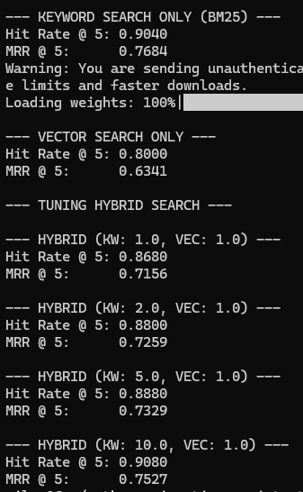
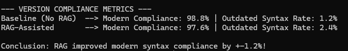

# Evaluation

Both halves of the pipeline — retrieval, and the final LLM answer — are evaluated with more than one approach, against the same LLM-generated ground truth set.

**The outputs are committed to the repo** — `data/evaluation/ground_truth.csv`, `rag_answers.csv`, and `version_compliance_evaluations` are all checked in, so you can inspect the actual questions, answers, and judgments directly without running anything or spending API budget. The sections below describe what each script does and which committed file to open for its output; see [setup.md](setup.md#running-the-evaluation-suite) if you want to regenerate them yourself instead.

## 1. Ground Truth Generation — `evaluation/01_generate_ground_truth.py`

Since there's no pre-existing Q&A dataset for "migrating FastAPI/Pydantic/SQLAlchemy code," ground truth is generated with an LLM:

- A stratified sample of chunks is drawn from the knowledge base: 17 FastAPI, 17 Pydantic, and 16 SQLAlchemy chunks (50 total), restricted to chunks with more than 40 words so there's enough substance to write a question from.
- For each sampled chunk, `gpt-5.4-mini` is prompted (using structured output with a `Questions` Pydantic model) to generate **5 realistic migration questions** answerable *only* from that chunk. Questions describe upgrading existing code from an older framework version to a newer major version, emphasize "how do I rewrite this old code?" scenarios, explicitly mention framework versions where applicable, and focus on migration patterns that are easy to confuse or accidentally mix.
- Output: `data/evaluation/ground_truth.csv` with `question`, `document` (the source chunk id), and `library` columns — up to 250 question/source pairs. **Committed to the repo** — open it directly to inspect the generated migration questions.

## 2. Retrieval Evaluation — `evaluation/02_evaluate_search.py`

For every ground-truth question, each retrieval strategy is asked for its top 5 results, filtered to the question's library. A result counts as a **hit** if it comes from the same source *file* as the chunk the question was generated from (matched at the file level, i.e. ignoring the specific sub-chunk number — a question can be legitimately answered by a neighboring chunk from the same doc page).

Two metrics are computed:

- **Hit Rate@5** — fraction of questions where at least one of the top 5 results is a hit
- **MRR@5** — mean reciprocal rank of the first hit (rewards putting the right document *first*, not just somewhere in the top 5)

Strategies compared:

| Strategy | Description |
|---|---|
| Keyword only | BM25 over the SQLite FTS5 index |
| Vector only | Cosine similarity over MiniLM embeddings |
| Hybrid (1:1, 2:1, 5:1, 10:1) | RRF fusion of both, swept across keyword:vector weight ratios |

The best-performing ratio from this sweep is what's hardcoded as the default in `HybridSearcher.__init__` (`kw_weight` / `vec_weight` in `src/hybrid_search.py`) — the comment above the class (`# To reflect Evaluation results, default weights...`) records that this default was chosen from these results, not guessed.

This script only prints to stdout — its results aren't saved to a CSV, so unlike the sections below there's no committed file to inspect directly. It's local-only (BM25 + embeddings, no LLM calls), so it's free and fast to run yourself:

```bash
python evaluation/02_evaluate_search.py
```



## 3. RAG vs. Baseline Answers — `evaluation/03_evaluate_rag.py`

For every ground-truth question, two answers are generated in parallel (10 worker threads):

- **RAG answer** — through the full `MigrationAssistant.answer_question()` pipeline (hybrid retrieval + system prompt + context), filtered to the question's library
- **Baseline answer** — the same LLM (`gpt-5.4-mini`) answering the raw question directly, with no retrieved context and no system prompt

The run is resumable: it loads any existing `data/evaluation/rag_answers.csv`, skips questions already answered, and only processes what's left — so a failed or interrupted run doesn't cost you a full re-run of the API calls. Output columns: `question`, `answer_llm` (RAG), `answer_baseline`, `answer_orig` (the source chunk's raw text, for reference), `document`. **Committed to the repo** — open `rag_answers.csv` directly to compare RAG vs. baseline answers side by side for every ground-truth question.

## 4. LLM-as-judge: Version Compliance — `evaluation/04_llm_judge.py`

Domain-specific evaluation measures whether the **recommended** migration solution consistently follows the requested target framework version.

Both the RAG answer and the baseline answer for every question are independently judged by `gpt-5.4-mini` using structured output (`VersionComplianceEvaluation`), which produces a `reasoning` string and two boolean fields:

- `contains_legacy_syntax` — whether the recommended solution relies on deprecated APIs for the target version (e.g. recommending Pydantic v1 `@validator` or SQLAlchemy 1.x `session.query()` for a migration to newer major versions).
- `contains_version_blending` — whether the recommended solution mixes APIs from different major framework versions within the same migration (e.g. combining Pydantic v1 and v2 syntax in the final solution).

The judge prompt explicitly allows "Before/After" comparisons. Legacy syntax shown only as historical context is ignored; only the final recommended solution is evaluated.

This produces two aggregate metrics for baseline vs. RAG-assisted answers:

```
Outdated Syntax Rate = % of answers flagged with contains_legacy_syntax

Version Blending Rate = % of answers flagged with contains_version_blending
```

`python evaluation/04_llm_judge.py` writes `data/evaluation/version_compliance_evaluations.csv` — **committed to the repo** — containing the judge's reasoning and both version-compliance verdicts for every baseline and RAG answer, along with a printed summary comparing the aggregate rates.



### Discussion

Interestingly, the baseline slightly outperformed the RAG pipeline on this metric (modern-syntax compliance), achieving approximately **1.2% higher compliance**.

This evaluation measures only whether the recommended solution contains legacy syntax. It does **not** measure answer completeness, factual grounding, or whether the response is supported by the project's documentation.

The RAG system intentionally grounds its answers in the indexed migration guides and release documentation. As a result, it may occasionally reproduce examples containing historical or transitional syntax when those examples are present in the source material. Meanwhile, the baseline LLM relies solely on its pretrained knowledge, which can sometimes produce slightly more modern-looking code despite lacking supporting references.

This result highlights that a single evaluation metric is insufficient to judge overall RAG quality. In practice, retrieval-augmented systems are primarily intended to improve factual grounding and traceability rather than simply maximize modern-syntax compliance.